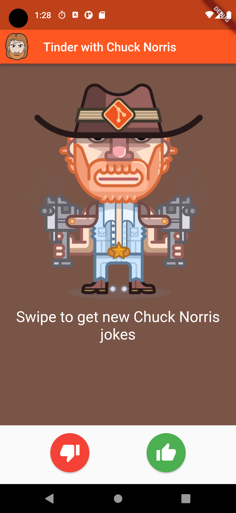
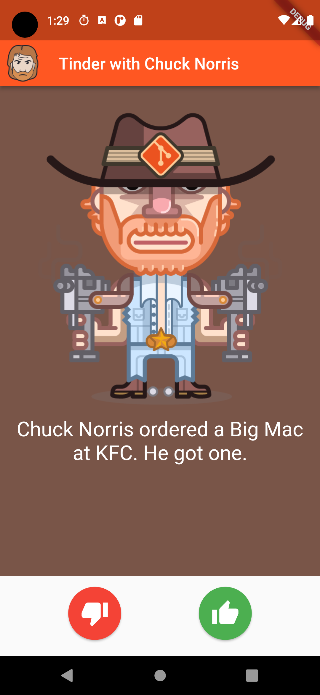

<!-- PROJECT LOGO -->
 

  

  <h3 align="center">Chuck Norris Jokes</h3>

  

    Get the hottest Chuck Norris Jokes on your phone anytime!
  

    
    

## About the project

A Tinder style app that gives you Chuck Norris jokes from [api.chucknorris.io](https://api.chucknorris.io). This app is build using the [Soar Quest](soar.quest) flutter framework.

## Installation

1. [Install flutter](https://docs.flutter.dev/get-started/install) (version >= 3.3.9)
2. run `flutter pub get` to install dependencies
3. run `flutter create . --platform android` to build to android

If you want to build apk from source run `flutter build apk`

## Contributing

Your contributions are always welcome, please look at the [contribution guidelines](CONTRIBUTING.md) for the detailed instructions.

## License

Our application is licensed under the [MIT License](LICENSE). This means that you are free to use, modify, and distribute the software as long as you include the appropriate credit and follow the terms of the license.
